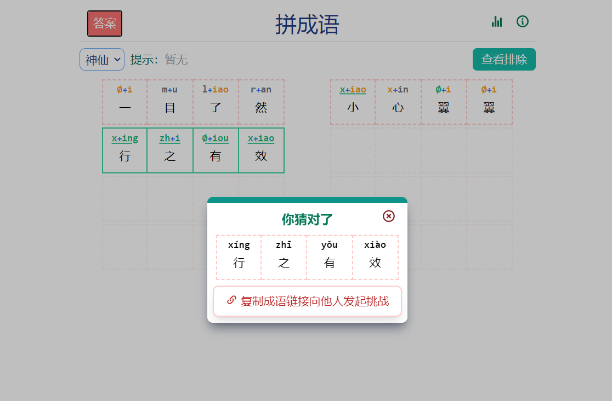

## 让我们开始！

## 介绍：
这是一个用于解决类似[汉兜](https://handle.antfu.me)、[拼成语](https://allanchain.github.io/chinese-wordle/) 这类应用的程序

## 目录结构
```
├─requirements.txt      依赖
├─auto.py               自动猜成语
├─guesser.py            主程序
├─idiom.json            原始成语数据
├─idiom_freq.json       成语频率数据
├─idioms.sqlite         成语数据库
├─idioms2db.py          生成成语数据库（非严格模式）
├─idioms2db_strict.py   生成成语数据库（严格模式）
├─img                   md_img
└─userdata              自定义用户文件夹
```

## 使用说明


|*|程序|结果      |
| ----| ---- | ---- |
|[汉兜](https://handle.antfu.me)| |  |
|[拼成语](https://allanchain.github.io/chinese-wordle/)| |  |

## 更多
基于[Playwright](https://playwright.dev/) 的自动化~~（无情的）~~猜成语机器
 
使用idiom-guesser基本能在3-4次内猜出成语
 
### 注意
使用下列代码将启用浏览器无痕模式

```
    browser = playwright.chromium.launch(headless=False, channel="msedge")
    context = browser.new_context()
    page = context.new_page()
```
若不想以无痕模式启动，使用下列代码
详见[playwright官网](https://playwright.dev/python/docs/api/class-browsertype#browser-type-launch-persistent-context)
```   
    browser = playwright.chromium.launch_persistent_context(
        headless=False,
        channel="msedge",
        # 换成自己的用户目录,
        user_data_dir='D:/path/to/userdata',
    )
    page = browser.new_page()
```

> 调用 `python -m auto_py_to_exe` 时，请确保您位于auto_py_to_exe下的目录中（在第3步之后），否则您将需要绝对/相对地将文件夹auto_py_to_exe引用到当前位置。
## 使用本程序
1. 选择您的脚本文件的位置（粘贴或使用文件浏览器）
   - 文件存在时轮廓将变为蓝色
2. 选择其他选项并添加图标或其他文件之类的内容
3. 点击底部的蓝色大按钮进行转换
4. 完成后在目录 /output中找到转换后的文件

*简单！*


## 测试

测试文件位于 `tests/` 中，它们被 pytest 运行:

```
$ pip install pytest
$ pip install -e .
$ pytest
```

## 屏幕截图
