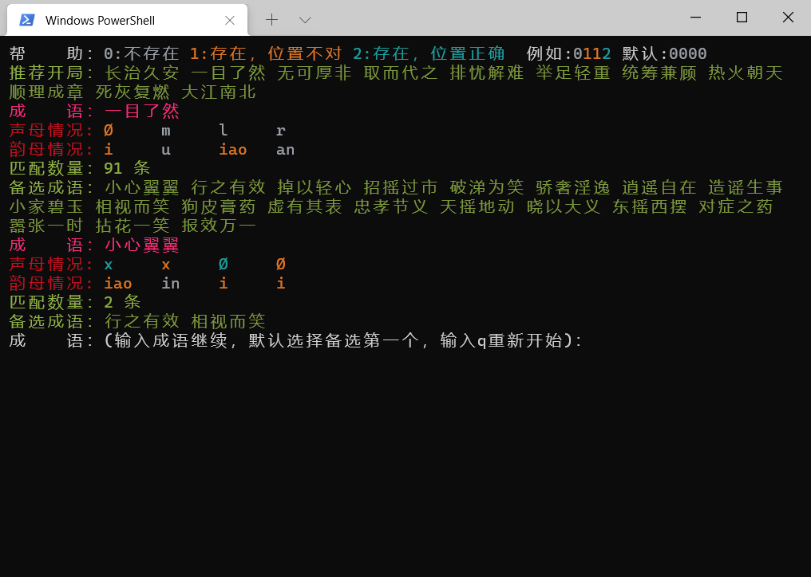

## 介绍：
这是一个用于解决类似[汉兜](https://handle.antfu.me)、[拼成语](https://allanchain.github.io/chinese-wordle/) 这类应用的程序

## 目录结构
```
├─requirements.txt      依赖
├─auto.py               自动猜成语
├─guesser.py            主程序
├─idiom.json            原始成语数据
├─idiom_freq.json       成语频率数据
├─idioms.sqlite         成语数据库
├─idioms2db.py          生成成语数据库（非严格模式）
├─idioms2db_strict.py   生成成语数据库（严格模式）
├─img                   md_img
└─userdata              自定义用户文件夹
```

## 使用说明
运行 `guesser.py`

>  如果你猜的成语中某一个声母或韵母(对于汉兜来说，还包含汉字与音调)：
>  - 位置与待猜成语相同，它就会被标成绿色，我们用 **2** 来表示
>  - 出现在待猜成语中但位置错误，就是黄色，我们用 **1** 来表示
>  - 压根没出现在待猜成语中，就是灰色，我们用 **0** 来表示
>
> 根据上述规则，以汉兜为例：输入 `无忧无虑` 得到4个字对应的声母、韵母等情况
>
>  - 声母应该为 `0000`，由于默认是 `0000`，我们可以不填
>  - 韵母应该为 `0100`
>  - 汉字应该为 `0000`，由于默认是 `0000`，不填
>  - 声调应该为 `0100`
>
> 敲下回车后会返回匹配的条目数以及出现频率最高的前20个成语备选  
> 重复上述操作，应该会在3-4次内得到答案 

|*|程序|结果|
| ----| ---- | ---- |
|[汉兜](https://handle.antfu.me)| |  |
|[拼成语](https://allanchain.github.io/chinese-wordle/)| |  |

## 更多
基于[Playwright](https://playwright.dev/) 的自动化 ~~无情的~~ 猜成语机器
 
使用idiom-guesser基本能在3-4次内猜出成语

 
5000次的数据，应该有较强的参考性

### 注意
使用下列代码将启用浏览器无痕模式

```
    browser = playwright.chromium.launch(headless=False, channel="msedge")
    context = browser.new_context()
    page = context.new_page()
```
若不想以无痕模式启动，使用下列代码
详见[playwright官网](https://playwright.dev/python/docs/api/class-browsertype#browser-type-launch-persistent-context)
```   
    browser = playwright.chromium.launch_persistent_context(
        headless=False,
        channel="msedge",
        # 换成自己的用户目录,
        user_data_dir='D:/path/to/userdata',
    )
    page = browser.new_page()
```
## 有用的提示
推荐以这些词开局

|成语|频率|成语|频率|成语|频率|
| ---- | ---- |---- | ---- |---- | ---- |
|长治久安|18732|一目了然|17310|无可厚非|13090|
|取而代之|12053|排忧解难|11980|举足轻重|11820|
|统筹兼顾|10847|热火朝天|9846|顺理成章|7282|
|死灰复燃|6643|大江南北|6408|无可争辩|6047|
|吃苦耐劳|5983|昏迷不醒|5980|一筹莫展|5585|
|百花齐放|5578|语重心长|5502|大张旗鼓|5315|
|轻描淡写|4927|不解之缘|4914|救死扶伤|4851|
|狂风暴雨|4789|叹为观止|4764|街头巷尾|4673|
|双管齐下|4511|刻骨铭心|4440|打成一片|4161|
|嘘寒问暖|4004|酸甜苦辣|3773|异口同声|3745|
|人声鼎沸|3667|得心应手|3642|袖手旁观|3614|
|始终不渝|3581|害群之马|3557|背井离乡|3546|
|轻重缓急|3361|剑拔弩张|3166|纸上谈兵|3153|
|火上浇油|3036|风调雨顺|2927|正本清源|2865|
|豁然开朗|2519|相濡以沫|2475|痛心疾首|2458|
|打破常规|2386|保家卫国|2313|满载而归|2288|
|瞒天过海|2234|峰回路转|2218|心满意足|2190|
|三足鼎立|2179|汗马功劳|2138|天罗地网|2111|
|以偏概全|2035|用心良苦|2027|步履维艰|1991|
|崇山峻岭|1980|信手拈来|1932|多管闲事|1917|
|周而复始|1880|一尘不染|1832|前因后果|1827|
|表面文章|1800|花团锦簇|1787|心领神会|1742|
|遍体鳞伤|1736|铁证如山|1694|身不由己|1673|
|不堪回首|1673|一反常态|1618|先睹为快|1606|
|枪林弹雨|1598|无懈可击|1571|雨过天晴|1535|
|回心转意|1524|妙语连珠|1503|姹紫嫣红|1501|
|见多识广|1498|大雨倾盆|1497|逆水行舟|1475|
|思前想后|1442|答非所问|1432|弄巧成拙|1408|
|口干舌燥|1384|灯红酒绿|1383|砸锅卖铁|1368|
|神通广大|1359|天南地北|1347|墨守成规|1308|
|繁花似锦|1301|柳暗花明|1298|铁面无私|1229|
|狼吞虎咽|1214|万马奔腾|1194|赤手空拳|1192|
|光彩夺目|1183|五光十色|1167|因循守旧|1154|
|去伪存真|1122|广开言路|1116|百年之后|1112|
|四脚朝天|1111|破釜沉舟|1100|马到成功|1082|
|痛改前非|1079|杀人灭口|1072|为非作歹|1063|
|由浅入深|1058|装聋作哑|1054|分庭抗礼|1053|
|劈头盖脸|1053|无价之宝|1052|乔装打扮|1049|
|画龙点睛|1040|胡思乱想|1040|扫地出门|1017|